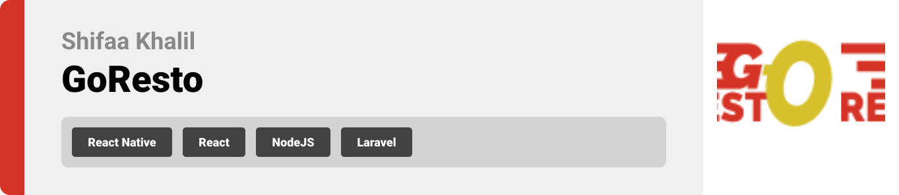

<br><br>

<!-- project philosophy -->


> A platform for restaurants to add their restaurants and manage their statistics, and a mobile app for customers to discover restaurants and reserve a table in a certain restaurant.

<!-- > Coffee Express aims to streamline the coffee-ordering process by providing a user-friendly platform for customers to place orders and pick up their coffee at their convenience. We believe in enhancing the coffee experience by saving time and ensuring customer satisfaction. -->

### User Stories

- As a customer, I want to be able to sign up and create an account.
- As a customer, I want to be able to sign in with my email and password to access my account.
- As a customer, I want to be able to reset my password so that if I forget it, I can regain access to my account.
- As a customer, I want to be able to search and discover existing restaurants and services.
- As a customer, I want to be able to choose a restaurant according to my preferences.
- As a customer, I want to be able to filter by location, price, category so that it becomes faster to choose a restaurant from a shorter list.
- As a customer, I want to be able to reserve a table so that I make sure there is a vacancy before going.
- As a customer, I want to be able to cancel my reservation.
- As a customer, I want to be able to receive notification of offers and new restaurants.
- As a customer, I want to be reminded of my reservation one day prior.
- As a customer, I want to be able to rate a restaurant so that other customers know if it is a good choice.
- As a customer, I want to be able to check ratings, reviews and comments, and comment on others reviews so that I can ask them more detailed questions about their experience in a certain restaurant.
- As a customer, I want to be able to check the menu of a restaurant so that I know the services and prices before reserving.
- As a customer, I want to be able to chat with the restaurant itself to ask my questions and make my reservation.
- As a customer, I want to be able to change the app theme according to my taste or mood.
- As a customer, I want to have restaurants according to my previous experience displayed on the home page.

- As a restaurant manager, I want to be able to sign up and create an account.
- As a restaurant manager, I want to sign in with my email and password to access my account.
- As a restaurant manager, I want to be able to reset my password so that if I forget it, I can regain access to my account.
- As a restaurant manager, I want to be able to add my restaurant and services so that I get more famous.
- As a restaurant manager, I want to be able to customize and add my menu so that my customers check the available meal and prices.
- As a restaurant manager, I want to be able to edit the menu on the website without uploading it again.
- As a restaurant manager, I want to be able to remove an item from the menu that is no longer served in my restaurant.
- As a restaurant manager, I want to be able to display reservations and restaurant views so that I can manage the restaurant statistics.
- As a restaurant manager, I want to be able to manage in-restaurant statistics including customers, orders, revenue...
- As a restaurant manager, I want to be able to add offers and promotions.
- As a restaurant manager, I want to be able to remove an offer.
- As a restaurant manager, I want to be able to update the restaurant data anytime.

- As an admin, I want to be able sign in with my email and password to access my account.
- As an admin, I want to be able to reset my password so that if I forget it, I can regain access to my account.
- As an admin, I want to be able to approve and reject adding new restaurants.
- As an admin, I want to be able to remove a restaurant.
- As an admin, I want to be able to manage user accounts, including adding, editing, and removing users, and setting roles and permissions.
- As an admin, I want to be able to use the support system that allows me to manage customer inquiries and issues.

<br><br>

<!-- Prototyping -->
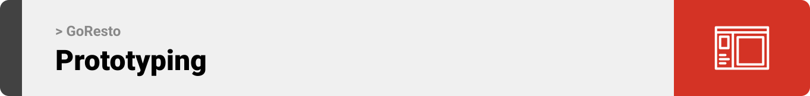

> I designed GoResto using wireframes and mockups, continually refining the layout until achieving an optimal design.

### Wireframes

| Login screen                            | Register screen                       | Landing screen                        |
| --------------------------------------- | ------------------------------------- | ------------------------------------- |
|  |  |  |

### Mockups

| Home screen                             | Menu Screen                           | Order Screen                          |
| --------------------------------------- | ------------------------------------- | ------------------------------------- |
|  |  |  |

<br><br>

<!-- Implementation -->
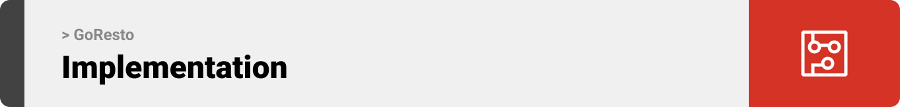

> Using the wireframes and mockups as a guide, I implemented the GoResto app with the following features:

### User Screens (Mobile)

| Login screen                              | Register screen                         | Landing screen                          | Loading screen                          |
| ----------------------------------------- | --------------------------------------- | --------------------------------------- | --------------------------------------- |
|  |  |  |  |
| Home screen                               | Menu Screen                             | Order Screen                            | Checkout Screen                         |
|  |  |  |  |

### Manager Screens (Web)

| Login screen                                     | Register screen                                | Landing screen                                |
| ------------------------------------------------ | ---------------------------------------------- | --------------------------------------------- |
| 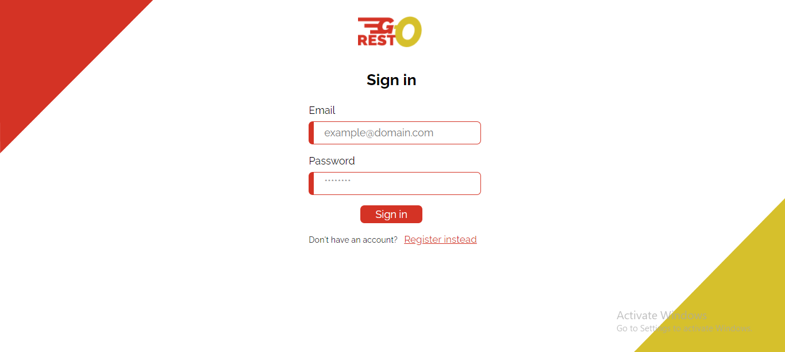         | 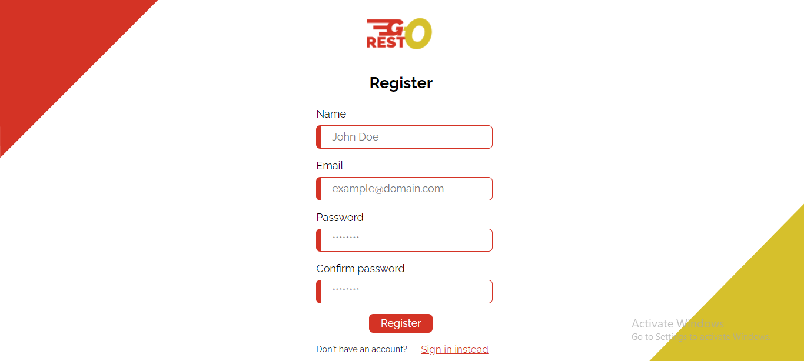 |   |
| Home screen                                      | Menu Screen                                    | Add Menu Item Screen Screen                   |
| 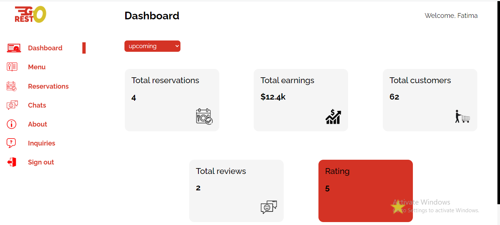 | 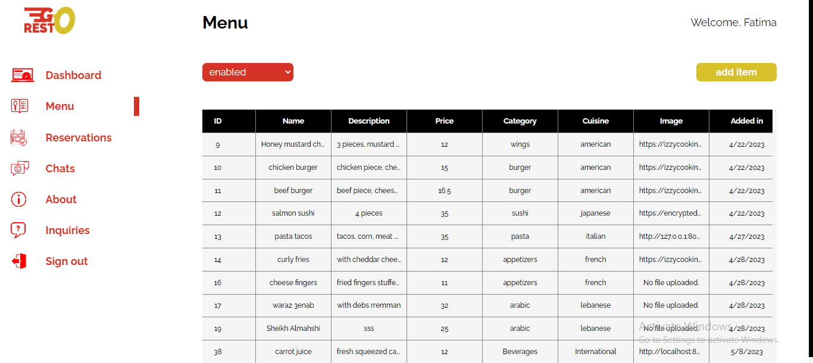         | 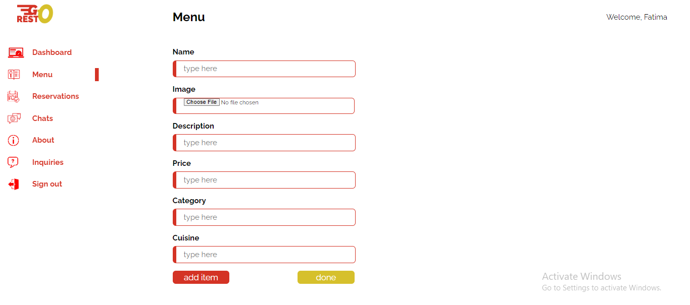 |
| Chats screen                                     | Inquiry Screen                                 | About Screen                                  |
|  | 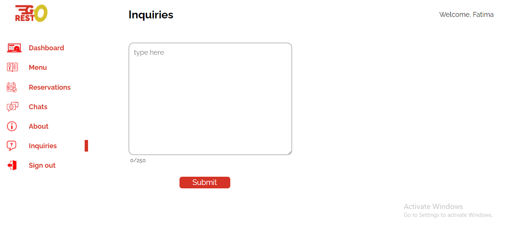   | 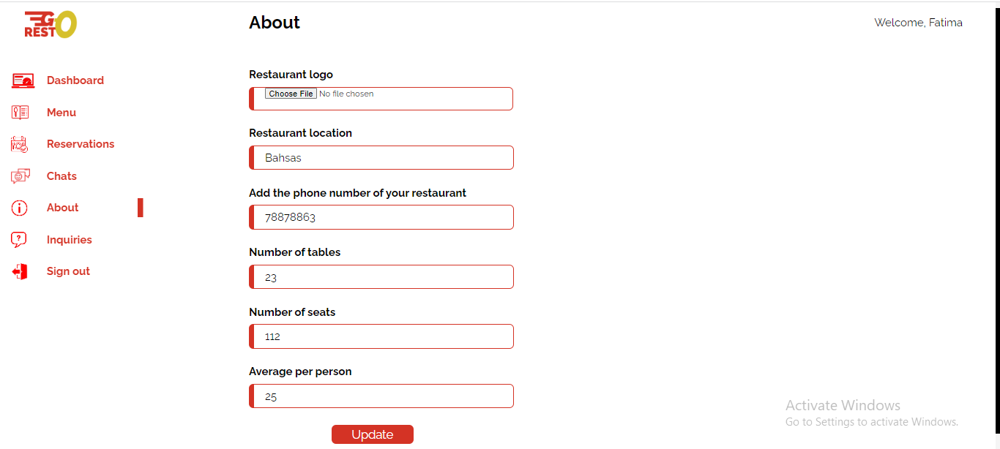      |

<br><br>

<!-- Tech stack -->
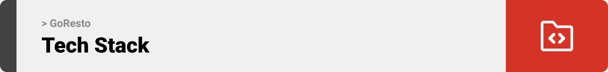

### GoResto is built using the following technologies:

- This project uses the React Native app development framework and the React web development framework along with electron for creating a desktop app.
- For persistent storage (database), the app uses MySQL databse along with MongoDB (for the chatting system)
- The app uses the font ["Raleway"](https://fonts.googleapis.com/css2?family=Fasthand&family=Raleway:wght@400;500;700;800;900&display=swap) as its main font, and the design of the app adheres to the material design guidelines.

<br><br>

<!-- How to run -->


> To set up GoResto locally, follow these steps:

### Prerequisites

This is an example of how to list things you need to use the software and how to install them.

- npm
  ```sh
  npm install npm@latest -g
  ```

### Installation

To install GoResto locally:

1. Open any terminal (like command prompt or vs terminal) and navigate to where you want to install the project (run cd folder-name)
2. Clone the repo
   ```sh
   git clone https://github.com/ShifaaKhalil98/GoResto.git
   ```
3. Navigate to the desktop app folder and install NPM packages
   ```sh
   npm install
   ```
4. Run the desktop app
   npm start
5. Make sure you have Node.js installed on your computer by visiting the official website

6. Navigate to the mobile app folder and install NPM packages
   npm install
7. Install expo
   npm install -g expo-cli
8. Run the mobile app
   expo start
9. Run it on the web
   press w

Now, you should be able to run GoResto (desktop app and mobile app) locally and explore its features.
