<br><br>

<!-- project philosophy -->


> A platform for business owners to list their restaurants and manage their statistics, and a mobile app for customers to discover restaurants and reserve a table in a certain restaurant.

### Customer Stories

- As a customer, I want to be able to filter by location, price, category, and rating to choose a restaurant according to my preferences.
- As a customer, I want to be able to check ratings, reviews, and comments, and comment on others' reviews so that I can ask them more detailed questions about their experience at a specific restaurant.
- As a customer, I want to be able to reserve a table to ensure there is availability before visiting.

### Manager Stories

- As a restaurant manager, I want to be able to add my restaurant and menu to increase its popularity.
- As a restaurant manager, I want to be able to remove an item from the menu that is no longer served in my restaurant.
- As a restaurant manager, I want to be able to view reservations and restaurant statistics.

### Admin Stories

- As an admin, I want to be able to approve or reject requests to add new restaurants.
- As an admin, I want to be able to remove a restaurant.
- As an admin, I want to be able to use the support system to manage restaurant inquiries and issues.

<br><br>

<!-- Prototyping -->


> I designed GoResto using wireframes and mockups, continually refining the layout until achieving an optimal design.

### Wireframes

| Landing Screen                                        | Register Screen                                         | Login Screen                                      |
| ----------------------------------------------------- | ------------------------------------------------------- | ------------------------------------------------- |
|  | 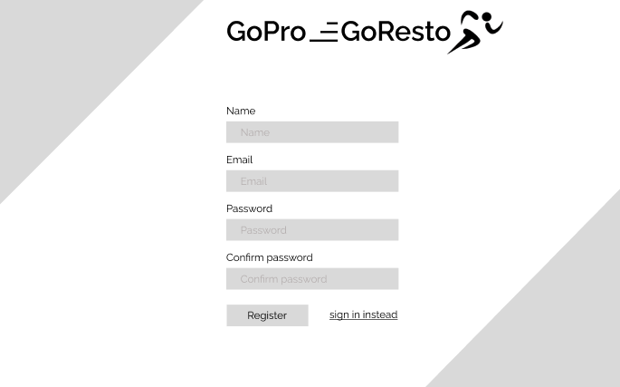 | 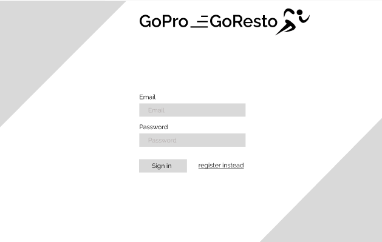 |

### Mockups

| Setup Screen                                    | Dashboard Screen                                        | Reservations Screen                                          |
| ----------------------------------------------- | ------------------------------------------------------- | ------------------------------------------------------------ |
|  | 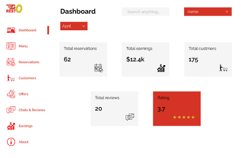 | 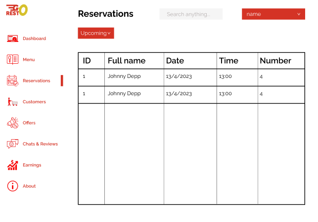 |

<br><br>

<!-- Implementation -->


> Using the wireframes and mockups as a guide, I implemented GoResto app with the following features:

### User Screens (Mobile)

| Login Screen                                         | Register Screen                                     | Loading Screen                                           | Home Screen                                          |
| ---------------------------------------------------- | --------------------------------------------------- | -------------------------------------------------------- | ---------------------------------------------------- |
| 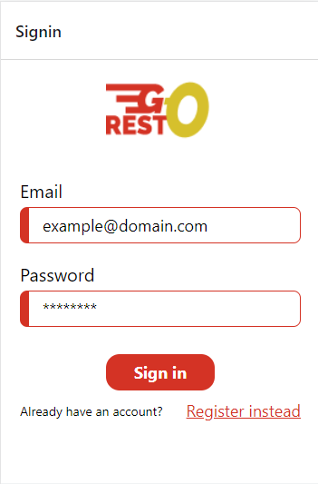      | 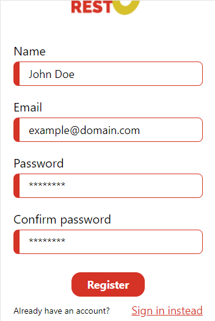 |              | 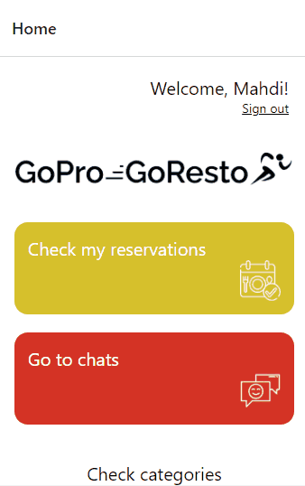               |
| Restaurants Screen                                   | Chats Screen                                        | Display Restaurant Screen                                | Menu Screen                                          |
| 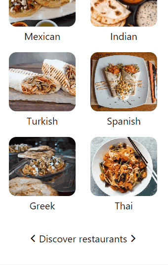 |             | 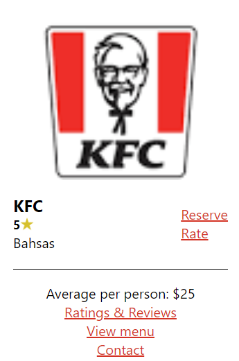 |                |
| Ratings & Reviews Screen                             | Rating Form Screen                                  | Reserving Form Screen                                    | Reservations Screen                                  |
|          | 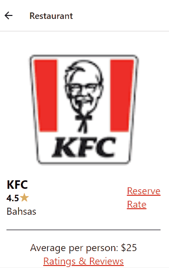          |         |  |

### Manager Screens (Web)

| Login Screen                             | Register Screen                                | Home Screen                                      |
| ---------------------------------------- | ---------------------------------------------- | ------------------------------------------------ |
|  |  |  |
| Setup Screen                             | Pending Screen                                 |
| 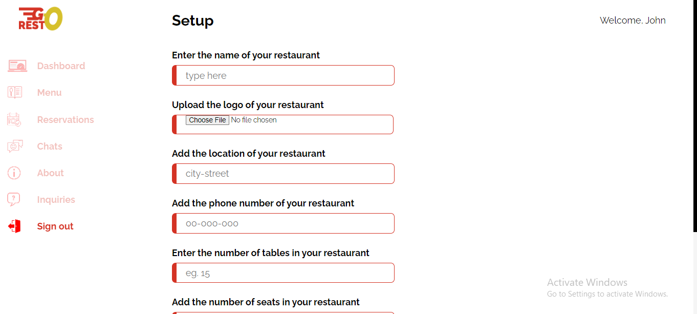 | 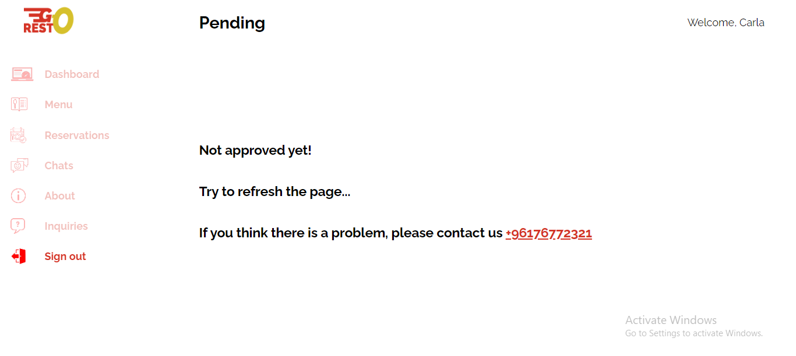   |

### Manager Screens /Animated (Web)

| Reservations Screen                                       | Menu Screen                                     | Add Menu Item Screen                              |
| --------------------------------------------------------- | ----------------------------------------------- | ------------------------------------------------- |
| 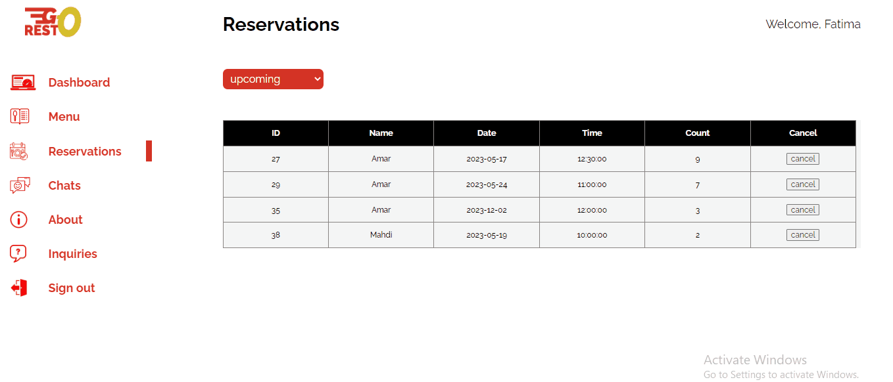 | 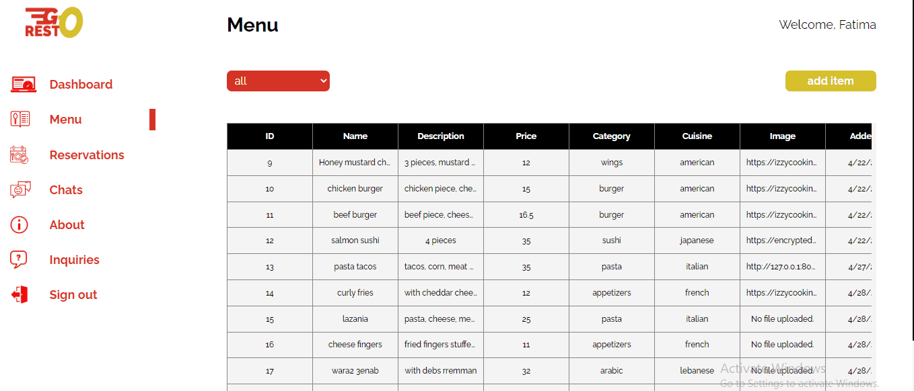       | 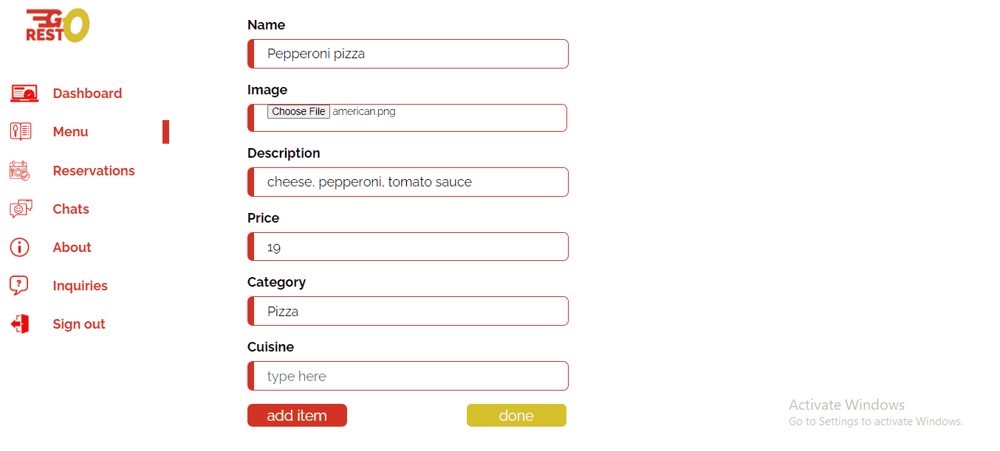 |
| Chats Screen                                              | Inquiry Screen                                  | About Screen                                      |
| 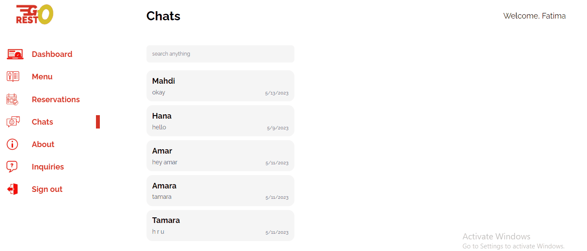               | 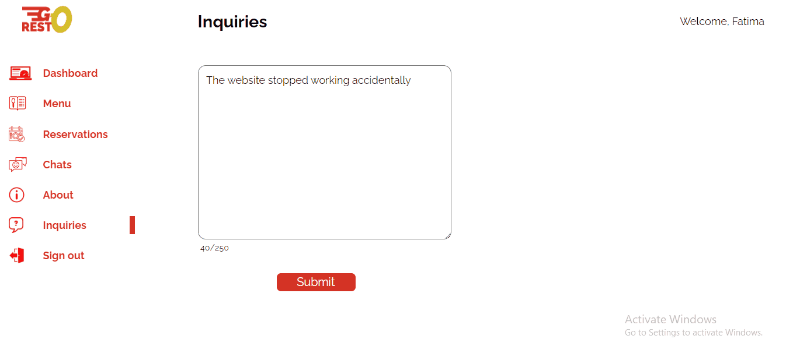 | 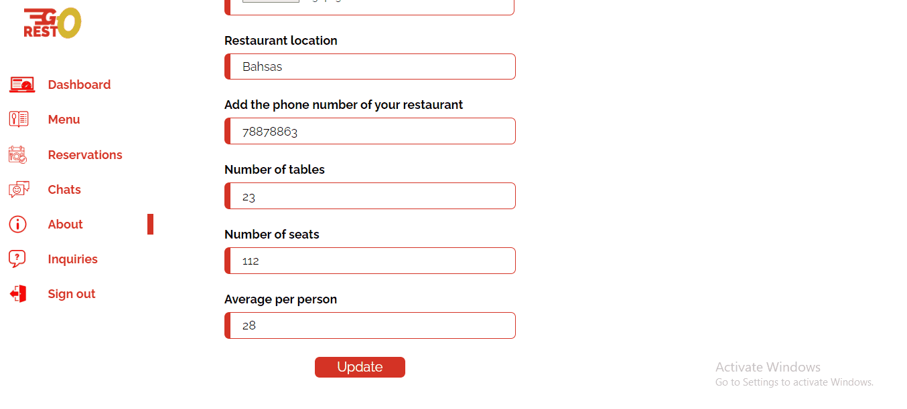      |
| Choosing Location                                         |
| 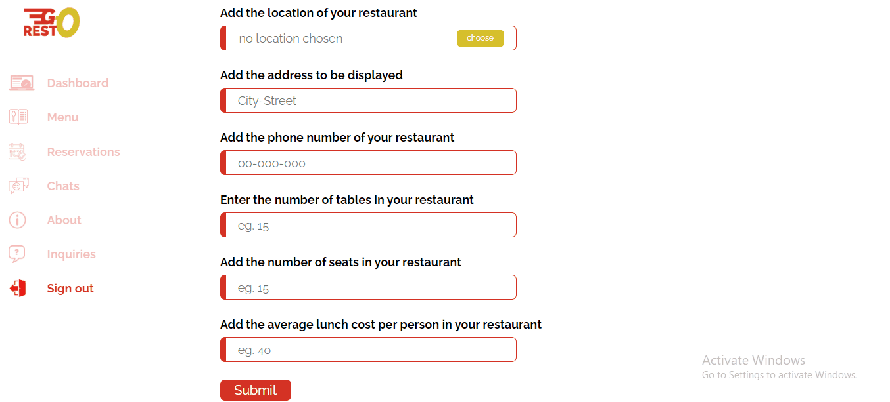                      |

### Admin Screens /Animated (Web)

| Removing User                                | Filtering Restaurants                                                  | Removing Restaurant                                            |
| -------------------------------------------- | ---------------------------------------------------------------------- | -------------------------------------------------------------- |
| 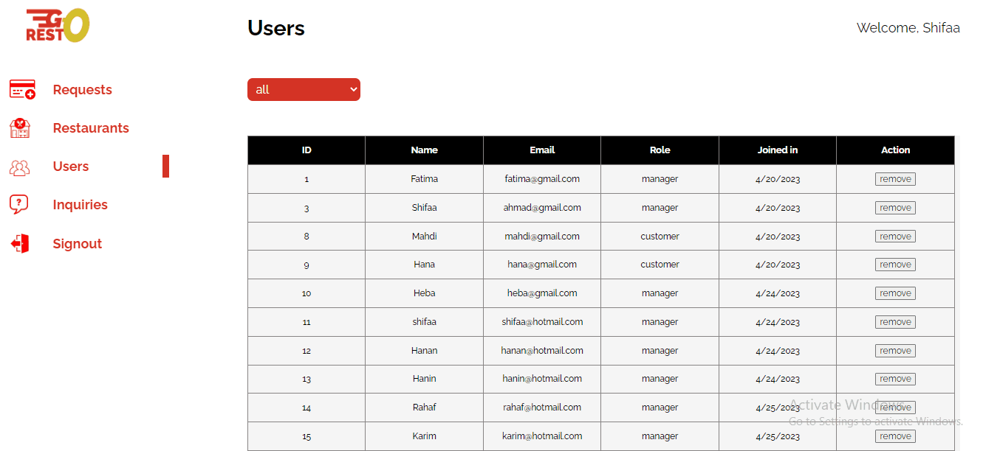 | 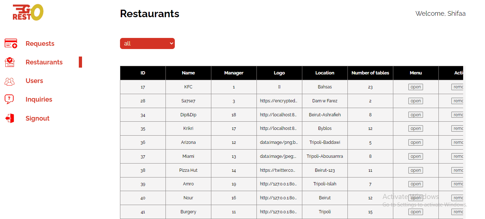 | 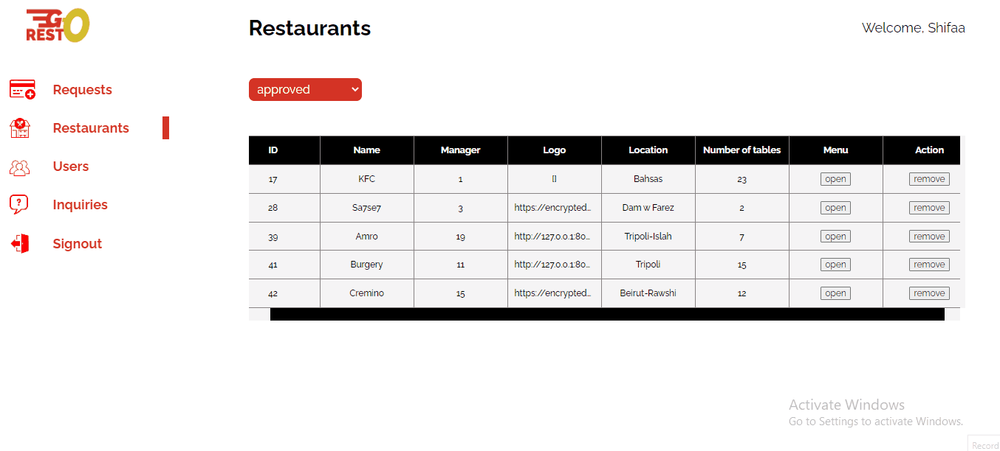 |
| Displaying Menu                              | Filtering Inquiries                                                    | Requests Screen                                                |
| 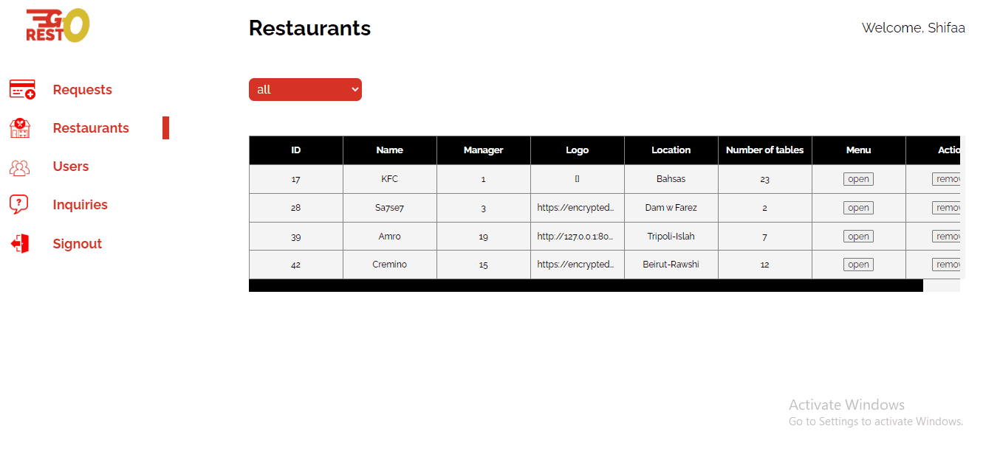  | 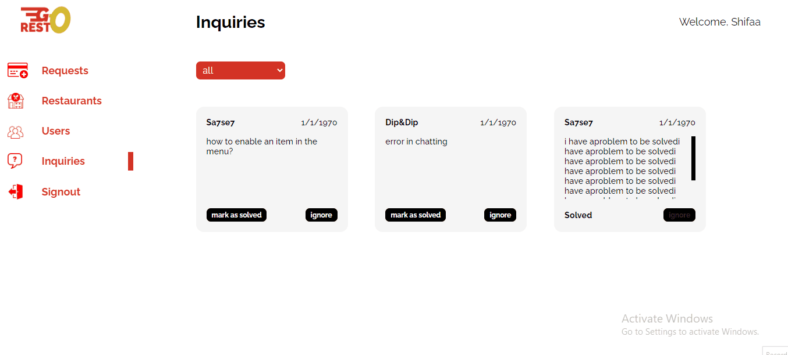             | 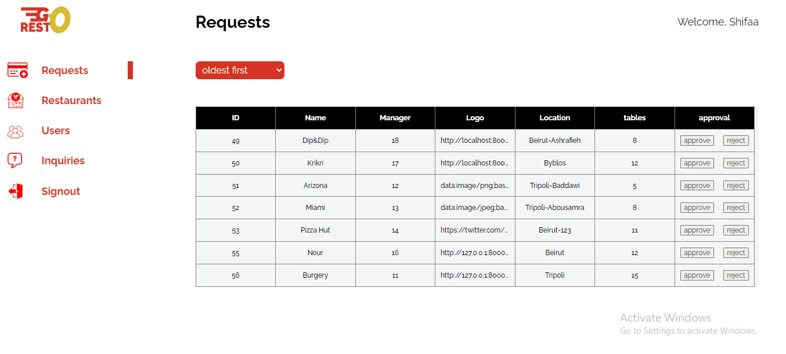            |

<br><br>

<!-- Tech stack -->


### GoResto is built using the following technologies:

- This project uses the React Native app development framework and the React web development framework.
- For persistent storage (database), it uses MySQL database along with MongoDB (for the chatting system).
- It uses the font ["Raleway"](https://fonts.googleapis.com/css2?family=Fasthand&family=Raleway:wght@400;500;700;800;900&display=swap) as its main font, and its design adheres to the material design guidelines.

<br><br>

<!-- How to run -->


> To set up GoResto locally, follow these steps:

### Prerequisites

- npm
  ```sh
  npm install npm@latest -g
  ```

### Installation

To install GoResto locally:

1. Open any terminal (like command prompt or vs terminal) and navigate to where you want to install the project

   ```sh
   cd folder-name
   ```

2. Clone the repo
   ```sh
   git clone https://github.com/ShifaaKhalil98/GoResto.git
   ```
3. Navigate to the web app folder and install NPM packages

   ```sh
   npm install
   ```

4. Run the web app

   ```sh
   npm start
   ```

5. Make sure you have Node.js installed on your computer by visiting the official website

   ```sh
   https://nodejs.org/en/download
   ```

6. Navigate to the mobile app folder and install NPM packages

   ```sh
   npm install
   ```

7. Install expo

   ```sh
   npm install -g expo-cli
   ```

8. Run the mobile app

   ```sh
   expo start
   ```

9. Run it on the web

   ```sh
   press w
   ```

10. Run the server in Laravel

    a. Visit https://getcomposer.org/download/ to install Composer then run the below command to install the dependencies

    ```sh
    expo start
    ```

    b. Migrate to the database

    ```sh
    php artisan migrate
    ```

    c. Run the server

    ```sh
    php artisan serve
    ```

Now, you should be able to run GoResto (web app and mobile app) locally and explore its features.
